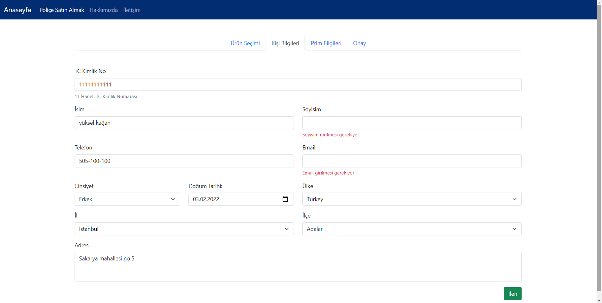
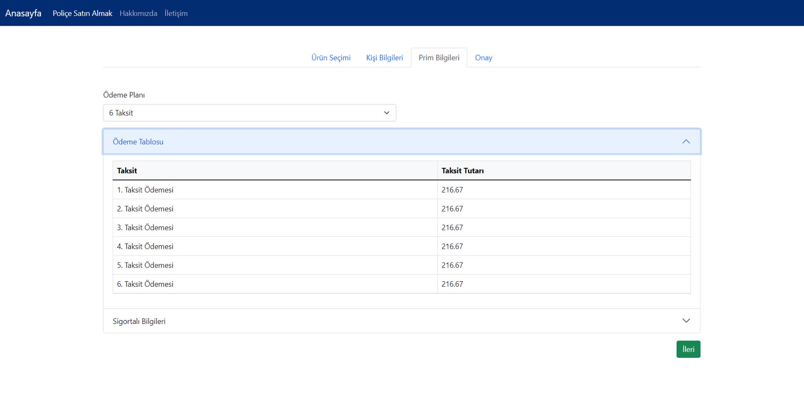
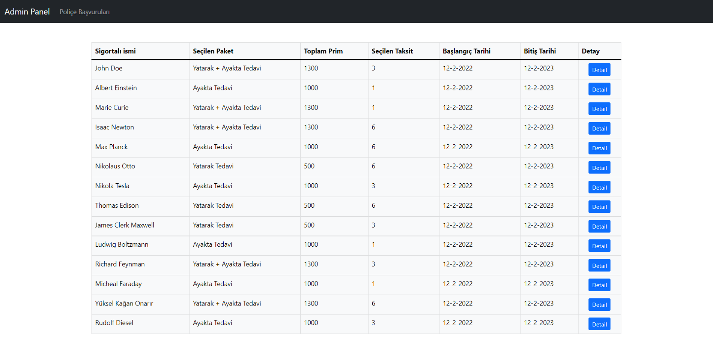
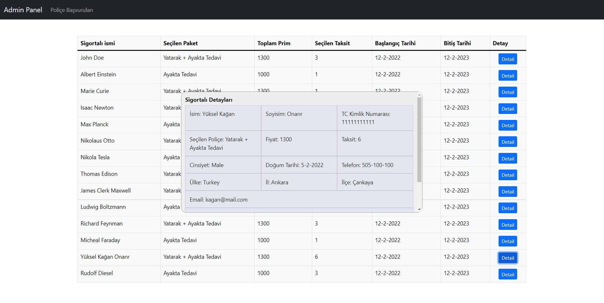

# Insurance Application

Patika.dev-Bupa Acıbadem Sigorta FullStack Bootcamp final projesi olarak hazırlandı.
İki bölümden oluşmaktadır. Birinci bölüm kullanıcı girişlerinin yapıldığı bölüm (Insurance),
ikinci bölüm bu girişlerin listelendiği admin paneli (InsuranceAdminPanel).
Proje Restfull API olarak geliştirilmiştir. 
Backend tarafında .Net 5, Frontend tarafında Angular 13, Bootstrap 5 kullanılmıştır.
Veritabanı olarak MSSQL, veritabanına bağlanma teknolojisi olarak ADO.NET kullanılmıştır.
Kullanıcı bölümü ve admin paneli ayrı API'lar ve Clientler ile çalışmaktadır.

Uygulamada kullanıcılar sağlık poliçeleri satın almaktadır. 
İstedikleri poliçeyi ve taksit miktarını seçip, kişisel bilgilerini girerek kayıtlarını oluşturmaktadırlar.
Oluşturulan kayıtlar admin panelde listelenmektedir.

<strong>Proje tanıtım videosu: </strong> [Insurance Application](https://www.youtube.com/watch?v=7bQTV4KFD7o)










## Yükleme

Uygulama bir veritabanına ihtiyaç duymaktadır. 
Database klasöründe bulunan "InsuranceDatabase" isimli veritabanını Sql Serverımıza yüklüyoruz.
Daha sonra API'ların veritabanını görmesi için veritabanının connection stringini API'ların
appsetting.json dosyasına giriyoruz. 
Insurance/Insurance.Api/appsetting.json ve InsuranceAdminPanel/InsuranceAdminPanel.Api/appsetting.json
dizinlerinde bulunmaktadır. Varsayılan olarak benim bilgisayarımdaki Sql servera göre connection stringi yazıyor. Bu stringi değiştirerek API'ların veritabanına bağlanmasını sağlıyoruz.

Ardından API'ları solution dosyalarından açarak Api katmanları üzerinden çalıştırabiliriz.
API'lar çalıştıktan sonra Client tarafına geliyoruz.

Client tarafında öncelikle node modules içerisindeki paketlerin yüklenmesi için
Clientin dizinindeyken

```
npm install
```

komutunu çalıştırıyoruz. Paketler yüklendikten sonra Clienti çalıştırmak için

```
ng serve --open
```

komutunu çalıştırıyoruz. Sırayla Insurance, InsuranceAdminPanel klasörlerindeki API'ları ve
InsuranceClient, InsuranceAdminClient klasörlerindeki Clientleri çalıştırıyoruz.
Böylelikle 2 Client, 2 API servisini çalıştırarak uygulamayı tamamen kullanılabilir hale getirmiş oluyoruz. 